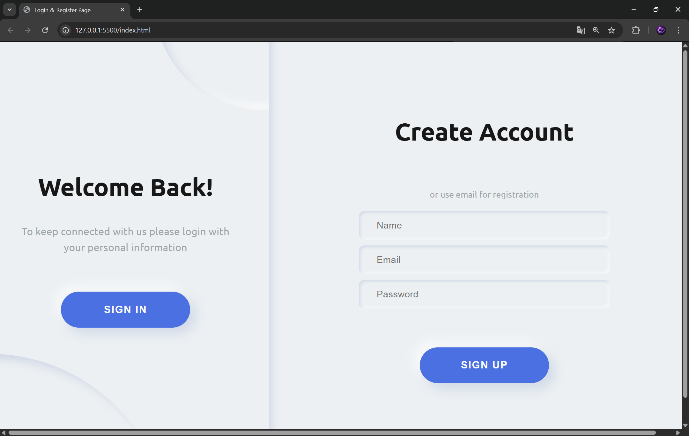

# 🔐 Neumorphism Login & Register Switch

Este proyecto es una interfaz moderna de **Login y Registro** con efecto de transición animado tipo *neumorphism*. Permite cambiar entre formularios de inicio de sesión y registro mediante un sistema interactivo con animaciones suaves.

---

## 🚀 Características

* 🔄 Cambio dinámico entre **Login** y **Register**
* 🎨 Diseño moderno estilo **Neumorphism**
* ✨ Animaciones suaves con clases CSS (`transition`, `transform`)
* 🧠 Manipulación del **DOM** con JavaScript
* 🖱️ Eventos interactivos (`click`, `load`)

---

## 📂 Estructura del Proyecto

```
📁 project
│── index.html
│── style.css
│── script.js
```

---

## 🧠 Funcionamiento del Código

### 🔹 Selección de elementos

Se utilizan `querySelector` y `querySelectorAll` para acceder a elementos del DOM:

```javascript
let switchFrm = document.querySelector('#switch-frm');
let switchCircle = document.querySelectorAll('.switch-circle');
```

---

### 🔹 Prevención de recarga

```javascript
let getButtons = (e) => e.preventDefault();
```

Evita que los botones recarguen la página al hacer clic.

---

### 🔹 Cambio de formularios

La función `changeForm` controla toda la animación:

* Agrega una animación temporal (`is-gx`)
* Cambia posiciones (`is-txr`)
* Alterna visibilidad (`is-hidden`)
* Mueve formularios (`is-txl`, `is-z200`)

```javascript
switchFrm.classList.toggle('is-txr');
regFrm.classList.toggle('is-txl');
```

---

### 🔹 Inicialización

Cuando la página carga:

```javascript
window.addEventListener('load', mainF);
```

Se agregan los eventos a todos los botones:

* Evitar recarga
* Cambiar formularios

---

## 🎮 Cómo usar

1. Abre el archivo `index.html`
2. Haz clic en los botones del switch
3. Observa cómo cambia entre Login y Register con animación

---

## 🛠️ Tecnologías utilizadas

* HTML5
* CSS3 (Flexbox, animaciones, neumorphism)
* JavaScript (DOM, eventos)

---

## 💡 Ideas para mejorar

* 🔐 Validación de formularios
* 📡 Conexión con backend (Node.js, Firebase, etc.)
* 🌙 Modo oscuro
* 📱 Diseño responsive

---


## 👨‍💻 Autor

Proyecto ideal para practicar:

* Manipulación del DOM
* Animaciones CSS
* Interfaces modernas

---

